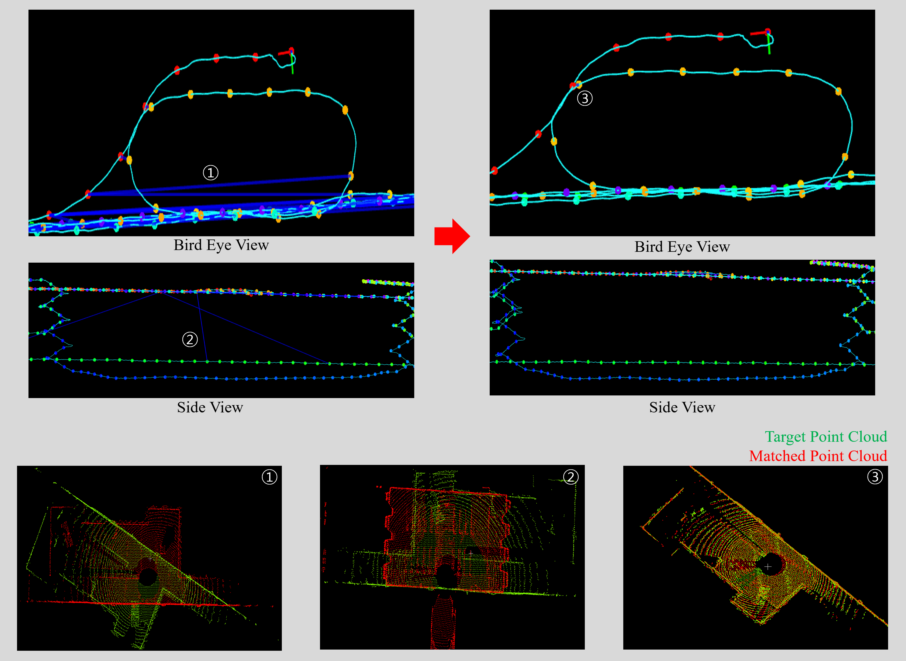

# Pose Graph Optimization

A ROS2 package for LiDAR-based pose graph optimization with loop closure detection, designed to work as a backend for [FAST-LIO2 Mapping & Localization](https://github.com/Kimkyuwon/fast_lio2_mapping_and_localization). This package generates globally consistent, drift-corrected maps with **dynamic object removal** using ground segmentation and point cloud clustering.

## Overview

```
FAST-LIO (Odometry)
       │
       │ /key_frame  (fast_lio::msg::Frame)
       ▼
┌─────────────────────────────────────────────────────┐
│              Pose Graph Optimization Node           │
│                                                     │
│  Thread 1: Loop Closure Detection (SOLiD)           │
│  Thread 2: Loop Edge Calculation (Nano-GICP + DOP)  │
│  Thread 3: Graph Optimization (GTSAM iSAM2)         │
│  Thread 4: Map Visualization                        │
└─────────────────────────────────────────────────────┘
       │
       ▼
  OptimizedMap.pcd   ← Pose-corrected full map
  StaticMap.pcd      ← Dynamic objects removed
  OptimizedNGMap.pcd ← Non-ground optimized map
  StaticNGMap.pcd    ← Non-ground static map
```

## Key Features

- **Loop Closure Detection**: [SOLiD](https://arxiv.org/abs/2408.07330) (Spherical Overlap-based Loop Detection) descriptor for robust place recognition
- **Loop Edge Estimation**: [Nano-GICP](https://github.com/vectr-ucla/direct_lidar_odometry) for accurate point cloud registration with Hessian-based noise modelling
- **DOP-based Loop Validation**: Dilution of Precision (DOP) metric for rejecting geometrically degenerate loop closures
- **Incremental Pose Graph Optimization**: [GTSAM iSAM2](https://gtsam.org/) with robust Cauchy noise model for loop constraints
- **Ground Segmentation**: [PatchWork++](https://github.com/url-kaist/patchwork-plusplus) for accurate ground/non-ground separation
- **Dynamic Object Removal**: Curved Voxel Clustering (CVC) + cross-frame consistency check to detect and remove moving objects
- **Multi-LiDAR Support**: Velodyne, Ouster, Hesai LiDARs
- **Designed for integration with** [FAST-LIO2 Mapping & Localization](https://github.com/Kimkyuwon/fast_lio2_mapping_and_localization) — a modified version of FAST-LIO2 extended with DOP-based scan matching confidence evaluation

## System Architecture

### Processing Pipeline

```
Keyframe Callback (kf_callback)
├── Save scan to disk (Scans/<idx>.pcd)
├── Build SOLiD descriptor
├── Add odometry factor to GTSAM graph
└── Signal loop closure / optimization threads

Loop Closure Thread (process_lcd)
└── SOLiD descriptor matching → candidate pairs → solidLoopBuf

Edge Calculation Thread (process_edge)
└── Nano-GICP registration + DOP validation → verified loop edges

Optimization Thread (process_optimization)
└── iSAM2 update → updatePoses()

Visualization Thread (process_viz)
└── Publish /PGO_map (downsampled global map)

Save Service (save_trajectory)
├── generateOptimizedMap()  → OptimizedMap.pcd
└── generateStaticMap()
    ├── PatchWork++ ground segmentation (per frame)
    ├── CVC clustering (per frame)
    ├── Cross-frame dynamic object removal
    └── StaticMap.pcd, StaticNGMap.pcd, OptimizedNGMap.pcd
```

## Dependencies

### System Libraries

| Library | Version | Purpose |
|---------|---------|---------|
| [GTSAM](https://github.com/borglab/gtsam) | ≥ 4.0 | Factor graph optimization (iSAM2) |
| [PCL](https://pointclouds.org/) | ≥ 1.8 | Point cloud processing |
| [Eigen3](https://eigen.tuxfamily.org/) | ≥ 3.3 | Linear algebra |
| [Boost](https://www.boost.org/) | — | system, timer, thread, serialization |
| OpenMP | — | Multi-core parallelization |

### ROS2 Packages

| Package | Purpose |
|---------|---------|
| [fast_lio](https://github.com/Kimkyuwon/fast_lio2_mapping_and_localization) | LiDAR odometry & keyframe source |
| [nano_gicp](https://github.com/vectr-ucla/direct_lidar_odometry) | Fast GICP for loop edge estimation |
| [patchworkpp](https://github.com/url-kaist/patchwork-plusplus) | Ground segmentation |
| `pcl_ros` | PCL–ROS2 bridge |
| `tf2`, `tf2_ros` | Transform handling |

## Installation

### 1. Install GTSAM

```bash
# Install from PPA (Ubuntu 22.04 / 24.04)
sudo add-apt-repository ppa:borglab/gtsam-release-4.1
sudo apt update
sudo apt install libgtsam-dev libgtsam-unstable-dev

# Or build from source
git clone https://github.com/borglab/gtsam.git
cd gtsam && mkdir build && cd build
cmake .. -DGTSAM_USE_SYSTEM_EIGEN=ON -DGTSAM_BUILD_EXAMPLES_ALWAYS=OFF
make -j$(nproc) && sudo make install
```

### 2. Clone and build dependencies

```bash
cd ~/your_ws/src

# FAST-LIO (modified version with DOP-based scan matching confidence evaluation)
# This is a custom fork extended by Kyu-Won Kim from the original FAST-LIO2
git clone https://github.com/Kimkyuwon/fast_lio2_mapping_and_localization.git --recursive fast_lio

# Nano-GICP
git clone https://github.com/vectr-ucla/direct_lidar_odometry.git

# PatchWork++
git clone https://github.com/url-kaist/patchwork-plusplus.git patchwork-plusplus-master

# This package
git clone https://github.com/Kimkyuwon/Pose_Graph_Optimization.git pose_graph_optimization
```

### 3. Build

```bash
cd ~/your_ws
colcon build --symlink-install --packages-select pose_graph_optimization
source install/setup.bash
```

## ROS2 Interface

### Subscribed Topics

| Topic | Type | Description |
|-------|------|-------------|
| `/key_frame` | `fast_lio/msg/Frame` | Keyframe from FAST-LIO (pointcloud + pose + index) |

### Published Topics

| Topic | Type | Description |
|-------|------|-------------|
| `/kf_node` | `sensor_msgs/PointCloud2` | Keyframe node positions |
| `/PGO_path` | `nav_msgs/Path` | Pose graph optimized trajectory |
| `/PGO_map` | `sensor_msgs/PointCloud2` | Live optimized global map |
| `/loopLine` | `visualization_msgs/Marker` | Loop closure edge visualization |

### Services

| Service | Type | Description |
|---------|------|-------------|
| `save_trajectory` | `pose_graph_optimization/srv/SaveMap` | Save optimized maps to specified directory |
| `cancel_save_trajectory` | `std_srvs/srv/Trigger` | Cancel an ongoing save operation |

#### SaveMap Service

```
# Request
string directory_name   # Target directory name (created under package root)
---
# Response
bool    success
string  message
```

**Example usage:**
```bash
ros2 service call /save_trajectory pose_graph_optimization/srv/SaveMap \
  "{directory_name: 'MyMap'}"

# Cancel if needed
ros2 service call /cancel_save_trajectory std_srvs/srv/Trigger "{}"
```

### Custom Messages

**`pose_graph_optimization/msg/Frame`**
```
std_msgs/Header header
sensor_msgs/PointCloud2 pointcloud
nav_msgs/Odometry pose
int32 frame_idx
```

## Parameters

Parameters are declared in the node and loaded from the FAST-LIO config YAML.

### Sensor Parameters

| Parameter | Default | Description |
|-----------|---------|-------------|
| `preprocess.scan_line` | `16` | Number of LiDAR scan lines |
| `preprocess.horizontal_resolution` | `1000` | Horizontal scan resolution |
| `preprocess.blind` | `0.01` | Minimum valid range (m) |
| `mapping.det_range` | `50.0` | LiDAR detection range (m) |

### Loop Closure Parameters (SOLiD)

| Parameter | Default | Description |
|-----------|---------|-------------|
| `posegraph.r_solid_thres` | `0.99` | SOLiD similarity threshold (0–1, higher = stricter) |
| `posegraph.fov_u` | `2.0` | LiDAR upper FOV angle (deg) |
| `posegraph.fov_d` | `-24.8` | LiDAR lower FOV angle (deg) |
| `posegraph.num_angle` | `60` | SOLiD descriptor angular bins |
| `posegraph.num_range` | `40` | SOLiD descriptor range bins |
| `posegraph.num_height` | `32` | SOLiD descriptor height bins |
| `posegraph.min_distance` | `3` | Minimum loop candidate distance (m) |
| `posegraph.max_distance` | `80` | Maximum loop candidate distance (m) |
| `posegraph.num_exclude_recent` | `30` | Number of recent frames excluded from loop search |
| `posegraph.num_candidates_from_tree` | `3` | Top-K candidates from KD-tree search |
| `posegraph.loop_dist` | `10.0` | Maximum spatial distance for loop candidates (m) |

### Map / Validation Parameters

| Parameter | Default | Description |
|-----------|---------|-------------|
| `posegraph.voxel_size` | `0.4` | Voxel grid leaf size for map downsampling (m) |
| `posegraph.dop_thres` | `0.5` | DOP ratio threshold for loop closure validation |
| `posegraph.sensor_height` | `0.0` | Sensor height from ground (m) for PatchWork++ |

### PatchWork++ Ground Segmentation Parameters

| Parameter | Default | Description |
|-----------|---------|-------------|
| `posegraph.num_iter` | `3` | Ground plane estimation iterations |
| `posegraph.num_lpr` | `20` | Max lowest point representatives |
| `posegraph.th_seeds` | `0.3` | Seed selection threshold |
| `posegraph.th_dist` | `0.125` | Ground plane thickness threshold |
| `posegraph.max_range` | `80.0` | Max range for ground estimation (m) |
| `posegraph.min_range` | `1.0` | Min range for ground estimation (m) |
| `posegraph.uprightness_thr` | `0.101` | Surface uprightness threshold |

## Running

> **Required**: [FAST-LIO2 Mapping & Localization](https://github.com/Kimkyuwon/fast_lio2_mapping_and_localization) is **required** to run this package. This node receives keyframes from `fastlio_mapping` via the `/key_frame` topic and cannot operate standalone.

### Launch

`mapping.launch.py` from the `fast_lio` package is configured to launch both `fastlio_mapping` and `posegraphoptimization` **simultaneously**. A single command starts both nodes together.

```bash
ros2 launch fast_lio mapping.launch.py config_file:=<your_lidar_config>.yaml
```

Internal structure of `mapping.launch.py`:
```python
fast_lio_node = Node(package='fast_lio',                  executable='fastlio_mapping')
pgo_node      = Node(package='pose_graph_optimization',   executable='posegraphoptimization')
# Both nodes share the same config YAML as parameters
```

Both nodes share the same config YAML file, so the config must include the `posegraph.*` parameters listed above.

Example config file selection:

| LiDAR | Config File |
|-------|-------------|
| Hesai Pandar 32 | `mapping_config.yaml` |
| Velodyne VLP-16 | `velodyne.yaml` |
| Ouster OS2-64 | `ouster64.yaml` |

### Play a ROS2 bag

```bash
ros2 bag play your_dataset.bag
```

### Save the Map

Once mapping is complete, call the save service:

```bash
ros2 service call /save_trajectory pose_graph_optimization/srv/SaveMap "{directory_name: 'MyMap'}"
```

This generates the following files under `<package_root>/MyMap/`:

```
MyMap/
├── OptimizedMap.pcd      # Full map with PGO-corrected poses
├── StaticMap.pcd         # Map with dynamic objects removed (ground included)
├── OptimizedNGMap.pcd    # Non-ground map before dynamic removal
├── StaticNGMap.pcd       # Non-ground static map
├── optimized_poses.txt   # TUM-format optimized trajectory
├── odom_poses.txt        # TUM-format raw odometry trajectory
├── edges.txt             # Pose graph edge list with covariances
└── Scans/                # Per-frame PCD scans (ground/nonground/cluster)
```

## Output Map Types

| File | Description |
|------|-------------|
| `OptimizedMap.pcd` | All keyframe scans aggregated with PGO-corrected poses |
| `StaticMap.pcd` | `OptimizedMap` with dynamic objects (vehicles, pedestrians) removed |
| `OptimizedNGMap.pcd` | Non-ground points only, before dynamic removal |
| `StaticNGMap.pcd` | Non-ground static points only |

**Trajectory file format** (TUM format):
```
timestamp tx ty tz qx qy qz qw
```

**Edge file format:**
```
from_idx to_idx tx ty tz roll pitch yaw cov0 cov1 cov2 cov3 cov4 cov5
```

## Algorithm Details

### Loop Closure: SOLiD

SOLiD encodes each keyframe scan into a compact 3D histogram using (Range, Angle, Height) bins. Loop candidates are retrieved via KD-tree nearest-neighbor search on the descriptor space. The similarity score threshold is controlled by `r_solid_thres`.

<div align="center">

</div>

### Loop Verification: DOP + GICP

For each loop candidate:
1. **Nano-GICP** registers the current scan against the loop candidate.
2. The **Hessian matrix** of the GICP solution is analysed — its maximum eigenvalue serves as the noise weight for the loop factor.
3. **DOP ratio** (`matching_dop / max(src_dop, tgt_dop)`) filters out geometrically degenerate matches (e.g., long corridors).

<div align="center">

</div>

### Pose Graph: GTSAM iSAM2

- **Prior factor**: First keyframe anchored at origin with tight noise (1e-12).
- **Odometry factors**: Consecutive keyframe relative poses with covariance from FAST-LIO.
- **Loop factors**: Verified loop edges with Cauchy robust noise model.
- iSAM2 runs additional update iterations when a loop is closed to ensure convergence.

### Dynamic Object Removal

1. **Ground segmentation**: PatchWork++ separates ground and non-ground points per frame.
2. **CVC clustering**: Curved Voxel Clustering groups non-ground points into objects.
3. **Cross-frame consistency**: Each cluster is checked against a local sub-map built from nearby frames. Clusters with < 95% spatial overlap are flagged as dynamic and removed.

<div align="center">

*Red: map without dynamic object removal / Blue: map with dynamic object removal applied*


</div>

## License

This software is licensed under the **GNU General Public License v2.0 (GPL-2.0)**, in accordance with the license of the primary dependency, [FAST-LIO2 Mapping & Localization](https://github.com/Kimkyuwon/fast_lio2_mapping_and_localization) (GPL-2.0).

Other dependencies and their licenses:

| Package | License |
|---------|---------|
| [FAST-LIO Localization and Mapping](https://github.com/Kimkyuwon/fast_lio2_mapping_and_localization) | GPL-2.0 |
| [Nano-GICP](https://github.com/vectr-ucla/direct_lidar_odometry/tree/nano_gicp) | MIT |
| [PatchWork++](https://github.com/url-kaist/patchwork-plusplus) | BSD 2-Clause |
| [nanoflann](https://github.com/jlblancoc/nanoflann) | BSD |
| PCL, GTSAM, Eigen3 | BSD / BSD-like |

> **Non-commercial use notice**: This software is primarily developed for academic and non-commercial research purposes. For commercial use, please contact the author.

See the [GPL-2.0 license text](https://www.gnu.org/licenses/old-licenses/gpl-2.0.html) for full terms and conditions. In summary, you are free to use, modify, and distribute this software, provided that any derivative work is also distributed under GPL-2.0 with source code made available.

## Maintainer

Kyu-Won Kim (kimku1125@naver.com)
